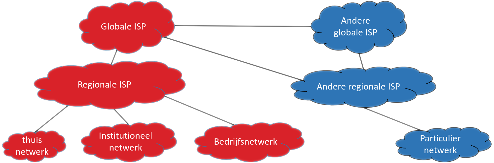
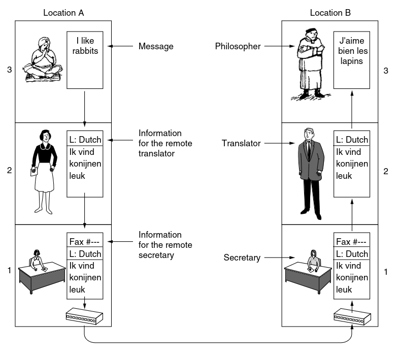
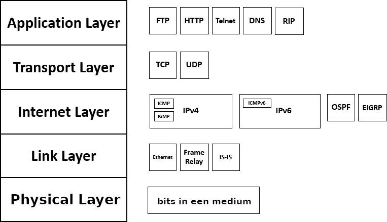
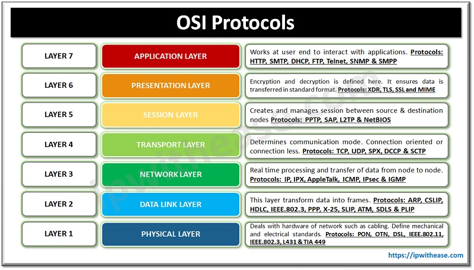
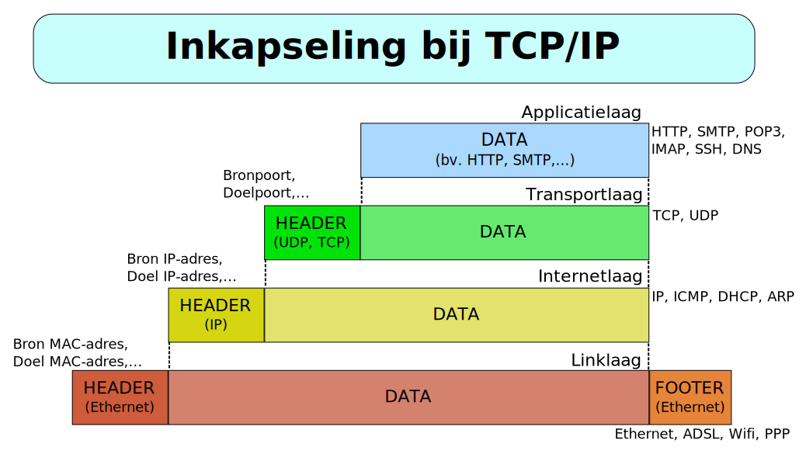
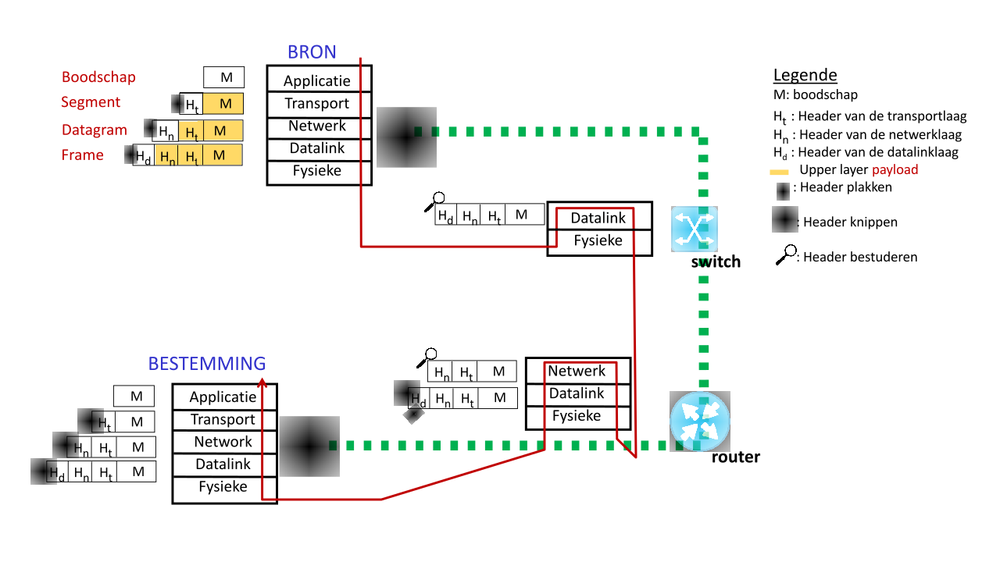
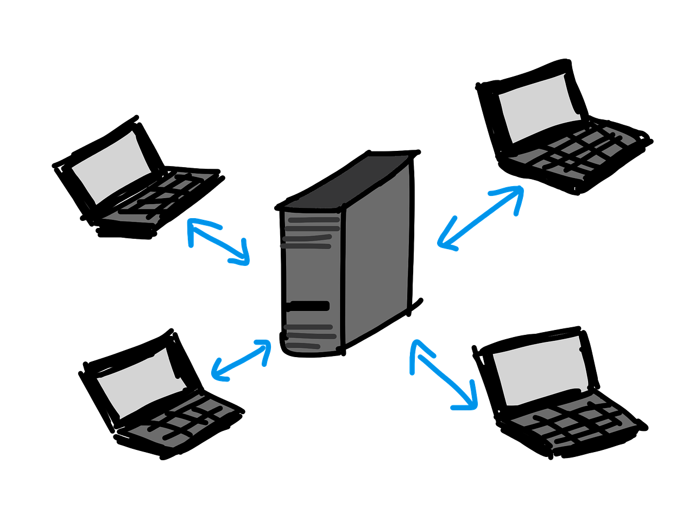
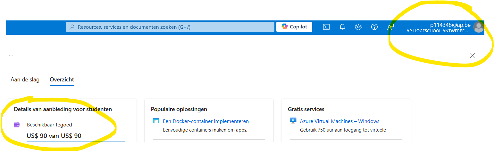

# Cloud systemen
---
Over mezelf

note:
- naam
- vakken
- mailadres
---
Situering vak

note:
- Programmeren netwerkapplicaties
- Security
- Algemene terminologie, foutmeldingen
- Servicemodel van software
---
ECTS-fiche
---
Volgorde stof

note:
- eerst basis computernetwerken
  - minder uitgebreid dan vroeger
  - niet bedoeling connectieproblemen te troubleshooten
  - wel zelf applicaties begrijpen en configureren
- dan vooral deployment van applicaties
---
Studiebelasting

note:
ECTS-fiche is referentiepunt
---
Studiemateriaal

note:
- Slides als leidraad
  - Instructies om ze te downloaden op DigitAP
  - In tegenstelling tot de cursus: technisch niet volledig!
- Gitbook cursus: de technische inhoud
- DigitAP: praktische kant
- Van jullie verwacht naast laptop: pen en papier
---
Evaluatie

note:
- 30 projectopdracht/30 toets/40 examen
- steeds gesloten boek met vooraf gedeelde cheat sheets
- projectopdracht doorheen de weken
  - stap 1 **meteen** tegen volgende keer: registreer op Azure, check je credits, documenteer of contacteer mij in geval van problemen
  - feedback: *in de les* na de deadline (niet via DigitAP, jullie noteren)
  - cijfer projectopdracht pas op het einde
---
Aanwezigheid

note:
- niet verplicht
- niet aanwezig ⇒ geen feedback, ook niet via mail of volgende keer
- deur dicht = deur dicht
  - je onderbreekt niet
  - je gaat gewoon voor het raam staan en je wacht tot de lector open doet
---
Materiaal en notities

note:
- geen eenvoudig vak
- alle stof staat in Gitbook en op DigitAP, dus niet nodig digitaal notities te nemen
- met pen en papier noteren als je dat graag doet (maar dus sowieso meebrengen)
---
Timing

note:
- start stipt
---
Communicatie

note:
- alle inhoudelijke vragen: forum
- persoonlijke aangelegenheden (les missen, toelichting faciliteiten,...): mail - geen Teams tenzij voor afstandsles (staat ook in statusbericht)
---
?

note:
- vragen over praktische kant, voor we aan stof beginnen?
---
Wat is een netwerk?
---
Een internet / Het Internet

<!-- figuur: Koen Laurent / Wouter Peetermans -->
---
Circuit switching
<iframe
  width="560" height="315"
  src="https://www.youtube.com/embed/zlMn0b5YKkk?si=NMDLZAXHcFLj0otO&amp;clip=UgkxnQqiu19tfYdm1VLW96s9VlbJg9HD-Qsp&amp;clipt=EAAYlDw"
  title="YouTube video player" frameborder="0"
  allow="accelerometer; autoplay; clipboard-write; encrypted-media; gyroscope; picture-in-picture; web-share"
  allowfullscreen></iframe>

note:
- dit is niet hoe een typisch computernetwerk werkt
---
Packet switching

<!-- Afbeelding van <a href="https://pixabay.com/nl/users/albarus-1663074/?utm_source=link-attribution&utm_medium=referral&utm_campaign=image&utm_content=4603815">René</a> via <a href="https://pixabay.com/nl//?utm_source=link-attribution&utm_medium=referral&utm_campaign=image&utm_content=4603815">Pixabay</a>-->

note:
- TCP/IP (de basis van het Internet) lijkt meer hierop
- wanneer werkt post algemeen sneller / trager dan anders?
- wat als je een hele grote zending verwacht?
- een "verbinding" bestaat alleen in de virtuele zin
---
Kenmerken packet switching

- (voortdurende) routering
- propagatie
- pakketverlies

note:
- denk aan verkeersinfrastructuur
- "bits op de kabel" (al is er niet altijd een kabel)
- noch verwerkingssnelheid, noch propagatiesnelheid is oneindig
---
Enkele basisconcepten:

- IP-adres (4 getallen)
- router

note:
- IP is een "protocol", een reeks afspraken voor communicatie
  - vraag: wat zijn de afspraken om een brief van A naar B te krijgen?
  - voorlopig genoeg te weten: toestel dat bereikbaar is over het Internet, heeft een IP-adres nodig, voorgesteld als 4 getallen tussen 0 en 255
    - realiteit is een pak complexer, maar dat was wel het oorspronkelijke idee
- **zeer sterke vereenvoudiging**, voorlopig genoeg om experimentjes te doen
---
Experimenten
---
Ping

- Windows: `ping /?`
- Mac / Linux: `man ping`
- geblokkeerd op AP-wifi en Eduroam, maar eigenlijk ongevaarlijk; kan op Bletchley

note:
- iemand die de term van ergens kent?
  - wat staat er dan vaak bij?
- geeft idee kwaliteit verbinding (snelheid respons)
- ontvanger is niet verplicht te antwoorden!
---
Opdracht

- verbind met Bletchley of zoek een online ping tool (`ping.eu`,...)
- ping volgende adressen:
  - www.marian.edu
  - telenet.be
  - www.ap.be
- noteer je antwoord op volgende vragen:
  - welke onderdelen spreken voor zichzelf?
  - welke onderdelen zijn je onbekend?
  - zijn er herhalingen? zo ja, waarom?
  - wat lijkt niet te veranderen?
  - wat zou je morgen anders verwachten?
---
Traceroute

- Windows: `tracert /?`
- Mac / Linux: `man traceroute`

note:
- doel zit in de naam
- verloren pakket wordt in principe gemeld **bij einde TTL**
- in principe is dit gewoon een reeks pings
---
Opdracht

- zoek, opnieuw via Bletchley of met online tool, de weg naar:
  - www.marian.edu
  - telenet.be
- noteer een antwoord op volgende vragen:
  - wat zou elke kolom betekenen?
  - wanneer eindigt het proces?
  - is dit gegarandeerd de weg die je data daarna zal volgen?
---
Opdracht

- run de Ookla speedtest
- welke twee aspecten van "snelheid" merk je hieruit op?

note:
- 3 componenten voor ping:
  1. om gewoon server te vinden
  2. om antwoord te krijgen tijdens downloaden
  3. om antwoord te krijgen tijdens uploaden
- bandbreedte *en* latency kunnen allebei of laag zijn, zijn twee andere dingen

---
Installatie-opdrachten:

- [Wireshark](https://www.wireshark.org/)
- [PacketTracer](https://www.netacad.com/cisco-packet-tracer)
<!-- Voor labo van 2u hier al de Azure-opdracht geven en dan stoppen? -->
---
Netwerkmodellen

note:
- abstractie
- schept orde
- allerlei apparaten
- allerlei media
- allerlei programma's en taken
---
Lagenschema

note:
- zelfde laag = zelfde soort taak
- kunnen rekenen op ondersteuning *onderliggende* laag
- werking hogere laag is "onzichtbaar"
- één interactie op één laag volgt één protocol
- kunnen meerdere protocols op dezelfde laag zijn
- **even conceptueel, zullen zien wat dit concreet betekent met Wireshark**
---
Voorbeeld: filosofen

<!-- figuur overgenomen uit Tanenbaum, Computer Networks, 5e editie -->
note:
- 3-lagenmodel
- analogie stopt hier, maar kan verder toegepast worden
  - we zouden een "faxlaag" kunnen voorzien, maar de fax is hier "black box"
---
Enkele termen:

- simplex
- duplex
- half-duplex

note:
- hangt af van communicatiekanaal en protocol
  - bv. walkie-talkie
---
Voordelen lagenmodel

- conceptueel overzicht
- relaties tussen gehelen zijn duidelijk
- "swappable" (met beperkingen, bv. bedraad naar draadloos of interplanetair...)
---
Theorie vs. praktijk

- Theorie: OSI-model
- Praktijk: TCP/IP-model
---
<!-- .slide:data-background="#ffffff"-->

<!--<a href="https://commons.wikimedia.org/wiki/File:Osi-model-jb.svg">SVG edition:Gorivero</a>,<a href="http://creativecommons.org/licenses/by-sa/3.0/">CC BY-SA 3.0</a>,via Wikimedia Commons-->
note:

- verwacht niet dat je ze na deze slide allemaal uit het hoofd kent
---

<!--afgeleid van afgeleid van <a
								href="https://commons.wikimedia.org/wiki/File:TCP-IP_Model_-_en.png">Michel Bakni</a>,
							<a href="https://creativecommons.org/licenses/by-sa/4.0">CC BY-SA 4.0</a>, via Wikimedia
							Commons-->
note:

- spreken soms over "laag 1", "laag 2",... en betreft dan meestal dit model, van onder naar boven
---

<!--<a
								href="https://commons.wikimedia.org/wiki/File:Comparaison_des_mod%C3%A8les_OSI_et_TCP_IP.png">tomsgued</a>,
							<a href="https://creativecommons.org/licenses/by-sa/3.0">CC BY-SA 3.0</a>, via Wikimedia
							Commons-->

note:
- fysieke laag wordt soms wel, soms niet vermeld 
---

note:
- niet uit het hoofd te kennen
- lagen zijn een hulpmiddel om zaken te situeren, realiteit past niet altijd perfect in deze vakjes
  - zelfde als in biologie,...
  - protocol wordt uitgewerkt en dan gesitueerd, niet omgekeerd
- naam "TCP/IP" verwijst naar de dominante protocols
- ook UDP past in deze stack!
- IP bestaat in meerdere vormen
---
<!-- .slide:data-background="#ffffff"-->

note:
- elke component ruwweg geassocieerd met bepaalde laag
- in principe enkel toegang tot eigen laag en lagere lagen
- metadata van lagere lagen mag worden aangepast, inhoud normaal niet
---
<!-- .slide:data-background="#ffffff"-->

<!--<a href="https://commons.wikimedia.org/wiki/File:Inkapseling_bij_tcp-ip-nl.svg">David Mudrák (mudrdmz)</a>, <a href="https://creativecommons.org/licenses/by-sa/3.0">CC BY-SA 3.0</a>, via Wikimedia Commons-->
note:
- allerlaagst: bits op het medium
- data van de hogere laag = "payload"
- "payload" is dus verschillend naargelang de laag
---

---
Client vs. server

<!--Client-server, afbeelding van <a href="https://pixabay.com/users/sandra_schoen-53876/?utm_source=link-attribution&utm_medium=referral&utm_campaign=image&utm_content=341420">Sandra Schön</a> from <a href="https://pixabay.com//?utm_source=link-attribution&utm_medium=referral&utm_campaign=image&utm_content=341420">Pixabay</a>-->
---
Demonstratie Wireshark

note:
- surf naar www.ubuntu.com of iets dergelijks en toon structuur
---
Opdracht met trace

- Welke lagen van TCP/IP zijn hier vertegenwoordigd?
- Uit hoeveel bytes bestaan de pakketjes?
- Hoeveel bytes bedraagt de payload in elk pakket?
- Van waar komen deze pakketjes eigenlijk? Wat heeft ze doen genereren?
- Wat is het laag 3-adres van de client in deze interactie?
- Wat is het laag 3-adres van de server in deze interactie?
- Is deze interactie "simplex", "duplex" of "half-duplex"?
---
Opdracht eigen traces

- Start een capture in Wireshark
- Surf naar neverssl.com
- Stop meteen de capture en sla op
- Start een nieuwe capture
- Surf naar www.ap.be
- Stop meteen de capture en sla op
- Zoek in beide captures de HTML voor de pagina
  - Verklaar

note:
- klassieke e-mail is niet versleuteld!
---
Opdracht Azure

- [deze pagina](https://azure.microsoft.com/nl-nl/free/students)
- kies "gratis aan de slag"
- probeer met `s...@ap.be` of met `voornaam.familienaam@student.ap.be` indien dat eerste niet werkt
- upload tegen volgende les screenshot
---
Voorbeeld:

