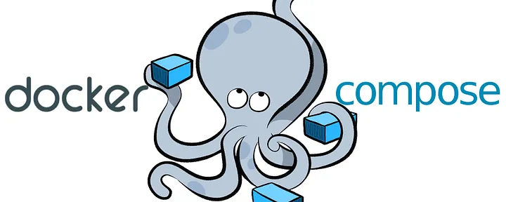

# Vervolg Docker

Tip: `docker exec -it NAAM_CONTAINER bash`
---
                <ul>
                    <li>Download "voorbeeldapplicatie Express"</li>
                    <li>Maak een nieuwe Dockerfile op basis van <code>ubuntu:latest</code></li>
                    <li>Kopieer de nodige bestanden naar een map <code>/app</code> in de image. </li>
                    <li>Update de lijst van pakketten (zie vorige oefening)</li>
                    <li>Installeer <code>nodejs</code> en <code>npm</code> (idem)</li>
                    <li>Zorg dat de nodige packages geïnstalleerd worden in de image.</li>
                    <li>Zorg dat de applicatie wordt opgestart wanneer de container start.</li>
                    <li>Zorg ook dat hij naar de gebruikte poort luistert.</li>
                    <li>Build en start de container.</li>
                </ul>

---
Bind mounts en volumes
---
Demonstratie: Express applicatie uitbreiden

note:
- "in memory" tot en met "in folder"
---
Vergelijking bind mounts en volumes

note:
- bind mount = gewoon map ergens "aansluiten" op container
- makkelijk om snel iets mee op te zetten; lastig voor permissies en management
- gespecifieerd als pad op de lokale machine
- volume = "harde schijf" die beheerd wordt door Docker
- gespecifieerd via naam
---
- `docker volume create VOLUMENAAM`
- `docker volume rm VOLUMENAAM`
- `docker volume ls`
---
Volume exporteren

```bash
docker run --rm \
-v db-volume:/db:ro \
-v $(pwd):/backup \
debian \
tar cvf /backup/backup.tar /db
```

note:
- keuze distributie is arbitrair
- we mounten zowel het volume als de huidige map (via bind mount)
- we archiveren de inhoud van het volume in de bind mount (dus komt in huidige map terecht)
- niet uit het hoofd te kennen, hou gewoon ergens bij
---
1. Maak een volume, `db-volume`
2. Maak een `mysql` container, waarvan de data bijgehouden wordt in dit volume
    1. Check eerst "where to store data" op de Docker Hub pagina!
    2. Het wachtwoord van `root` is `DitIsGoed`
    3. Er is een gewone user `dbUser`
    4. Het wachtwoord van deze user is `DitIsGoed`
    5. De database heet `Cloudsystemen`
3. Maak een tabel naar keuze aan met minstens één rij aan data
4. Verwijder de container
5. Maak een nieuwe container, log daar op in en controleer of je de data terugvindt
---
(einde stof toets)
---
Container networking

note:
- start twee containers op, één Apache server, de andere één die beschikt over `curl`
- probeer de Apache aan te spreken via naam
- dit werkt niet: containers zijn standaard geïsoleerd van elkaar
- via hostnaam werkt het wel: zitten op een impliciet netwerk met beperkte mogelijkheden
---
Demonstratie: Express applicatie uitbreiden

note:
- "met manuele MySQL"
---
- `docker network create NETWERKNAAM`
- `docker network rm NETWERKNAAM`
- `docker network ls`
- `docker run --network NETWERKNAAM ...`
- `docker network connect NETWERKNAAM CONTAINERNAAM`
---
DNS-resolutie in Docker

note:
- namen van containers als hostnamen gebruiken (intern DNS-systeem)
- dit werkt alleen op expliciet aangemaakte netwerken, niet op het automatisch aangemaakte `bridge` netwerk!
---
Opdracht: uitbreiden met Mailhog

note:
- download de code voor het guest book met Mailhog
- configureer de containers zodat de volledige applicatie werkt
---

note:
- kan command line argumenten bijhouden in file
- kan meerdere containers samen opstarten, meteen in netwerk, met volumes
- gebruikt YAML syntax
- intro tot YAML en YAML converter gelinkt
---
Demonstratie: omzetting volledige applicatie
---
Workshop (deel 3) (geen onderdeel toets)

note:
- Azure Container Instance ≅ Amazon ECS
 - meer "managed"
- Azure Virtual Machines ≅ Amazon EC2
 - meer eigen controle, maar ook meer eigen werk
- Doorlopen. Niet overal hetzelfde als in schriftelijke uitleg ⇒ vraag het aan de lector!
- Wissen resource group op het einde: moet specifiek op detailpagina van die groep staan.
